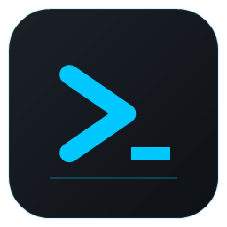

<div align="center">



# WinKuake

**A modern drop-down terminal for Windows.**
Press `F12`, the terminal slides down from the top of your screen. Press `F12` again, it slides back.

[](#)
[](#)
[](#)

</div>

---

## Why WinKuake

If you used [Yakuake](https://apps.kde.org/yakuake/) on Linux, you already know the workflow. Quake-style drop-down terminals stay out of your way until you need them, then they're one keypress away — no Alt+Tab, no window juggling.

WinKuake brings that workflow to Windows with a **native WPF / .NET 10 app** powered by **ConPTY + xterm.js (WebView2)**. It's standalone — it does **not** depend on Windows Terminal, WSL host, or any external launcher.

## Features

- **Quake-style drop-down** with smooth slide animation, configurable height/width as a percentage of the screen.
- **Global hotkey** (default `F12`, configurable to any combo of `Ctrl/Alt/Shift/Win + key`).
- **Profiles auto-detected**: Windows PowerShell, PowerShell 7, cmd, all installed **WSL** distros, **Git Bash**, **Visual Studio Developer** (Cmd Prompt + PowerShell, per VS install). Add your own with custom command lines.
- **Tabs and recursive splits** (vertical and horizontal, no depth limit). Drag tabs to reorder, pin tabs, jump-to-tab with `Ctrl+Shift+1..9`.
- **Multi-pane workflows**: focus by direction with `Alt+Arrows`, **broadcast input** to every pane (`Ctrl+Shift+B`).
- **Command palette** (`Ctrl+Shift+P`) with 21 default snippets (git, docker, npm, dotnet…) plus your own. Variables: `{cwd}`, `{home}`, `{user}`, `{date}`, `{branch}`, `{selection}`.
- **Workspaces**: save and restore named tab layouts (including the full split tree per tab).
- **Right-click context menu** on any pane: copy, paste, find, split, close, palette, clear.
- **Global search** across every open buffer (`Ctrl+Shift+Alt+F`) — find that error message you saw earlier across all panes at once.
- **Custom themes**: 5 built-in (VSCode Dark+, Dracula, Nord, Gruvbox Dark, Monokai) plus a full 19-color custom palette editor.
- **Persistent everything**: tabs, splits, workspaces, window size (drag the borders, it's saved), profile choice, theme, font size, hotkey, snippets. All in `%AppData%\WinKuake\settings.json`.
- **Tray icon** with show/hide/settings/quit menu.
- **Self-contained `.exe`** (single file, no .NET runtime to install).

## Shortcuts

| Shortcut | Action |
|---|---|
| `F12` | Show / hide WinKuake |
| `Ctrl+Shift+T` | New tab |
| `Ctrl+Tab` / `Ctrl+Shift+Tab` | Next / previous tab |
| `Ctrl+Shift+1..9` | Jump to tab N |
| `Ctrl+Shift+PageUp` / `PageDown` | Move active tab |
| `Alt+Shift++` (or `Ctrl+Shift+D`) | Split vertical |
| `Alt+Shift+-` (or `Ctrl+Shift+E`) | Split horizontal |
| `Alt+↑ / ↓ / ← / →` | Focus neighbor pane |
| `Ctrl+Shift+W` | Close pane |
| `Ctrl+Shift+P` | Command palette |
| `Ctrl+Shift+B` | Toggle broadcast input |
| `Ctrl+Shift+F` | Find in current buffer |
| `Ctrl+Shift+Alt+F` | Global find across all panes |
| `Ctrl+Shift+S` | Save buffer to file |
| `Ctrl+Shift+C` / `Ctrl+Shift+V` | Copy / paste (with bracketed paste) |
| `Ctrl+L` | Clear buffer |
| `Ctrl++` / `Ctrl+-` / `Ctrl+0` | Zoom in / out / reset |

All shortcuts are remappable from **Settings → Shortcuts**.

## Requirements

- **Windows 10 1809+** or **Windows 11**.
- **Microsoft Edge WebView2 Runtime** (preinstalled on Windows 11; the installer offers to download it on Win 10 if missing).
- That's it. No Windows Terminal, no Python, no extra runtime.

## Install

Download the latest `WinKuake-Setup-x.y.z.exe` from the [releases page](https://github.com/omazapa/winkuake/releases) and run it. Per-user install, no admin required.

The installer offers:
- Desktop shortcut.
- Launch with Windows on sign-in.
- Run WinKuake right after install.

To uninstall: standard Windows "Add or remove programs". Your settings in `%AppData%\WinKuake\` are kept on uninstall (so reinstalling a newer version preserves your profiles, workspaces and snippets).

## Build from source

```powershell
# Restore + build (Debug)
dotnet build src\WinKuake\WinKuake.csproj

# Run
dotnet run --project src\WinKuake\WinKuake.csproj

# Tests
dotnet test tests\WinKuake.Tests\WinKuake.Tests.csproj

# Publish self-contained .exe
dotnet publish src\WinKuake\WinKuake.csproj -c Release -r win-x64 `
    --self-contained true -o publish

# Build the installer (requires Inno Setup 6)
iscc installer\WinKuake.iss
# → installer\Output\WinKuake-Setup-0.1.0.exe
```

## Branding

WinKuake's identity is built around a single motif: a stylized command-line **caret + cursor** (`❯_`) on a rounded square, in electric cyan over graphite.

| Asset | Use |
|---|---|
| `assets/branding/logo.svg` | Vector source of the glyph. |
| `assets/branding/logo-horizontal.svg` | Logo with wordmark for headers and READMEs. |
| `assets/branding/dist/winkuake.ico` | App and installer icon (multi-resolution 16..256). |
| `assets/branding/dist/winkuake-{N}.png` | Raster glyph at common sizes (16, 24, 32, 48, 64, 128, 256, 512). |
| `assets/branding/dist/wizard-image.bmp` | Inno Setup wizard banner (164×314). |
| `assets/branding/dist/wizard-small.bmp` | Inno Setup wizard small banner (55×58). |

Re-render any time with `pwsh assets/branding/build-assets.ps1`. The script redraws the logo with `System.Drawing` so there are no external dependencies (no Inkscape, no ImageMagick).

**Palette:**

| Token | Hex | Use |
|---|---|---|
| Accent | `#00C8FF` | Primary action, focus, active tab |
| Accent dark | `#0099CC` | Gradients, hover, secondary actions |
| Background dark | `#0E1116` | Window background |
| Surface | `#1B2027` | Chrome, status bar |
| Text high | `#E8EDF2` | Foreground text |
| Text low | `#8A93A0` | Secondary text, hints |

## Architecture (10-second overview)

- **WPF host** — drop-down window, animation, hotkey, tabs, splits, settings UI.
- **ConPTY** (`Services/ConPtyService.cs`) — Win32 pseudo-console per pane, real shell I/O.
- **WebView2 + xterm.js** — terminal rendering, scrollback, search, hyperlinks. One WebView per pane, all sharing a single `CoreWebView2Environment`.
- **ProfileRegistry** — pluggable detectors (`Services/Detectors/`) for PowerShell, cmd, WSL, Git Bash, VS Developer. No dependency on Windows Terminal's `settings.json`.
- **Settings** — persisted POCO in `%AppData%\WinKuake\settings.json`.

For the full design, see [`PLAN.md`](PLAN.md).

## Project status

Active development. **465 unit tests** cover the engine, settings persistence, profile detection, splits tree, and UI helpers. Build is clean.

## License

TBD — currently no license file. Treat as personal-use until one is added.

---

<div align="center">

<sub>Built with C# 12 · .NET 10 · WPF · WebView2 · xterm.js · ConPTY</sub>

</div>
